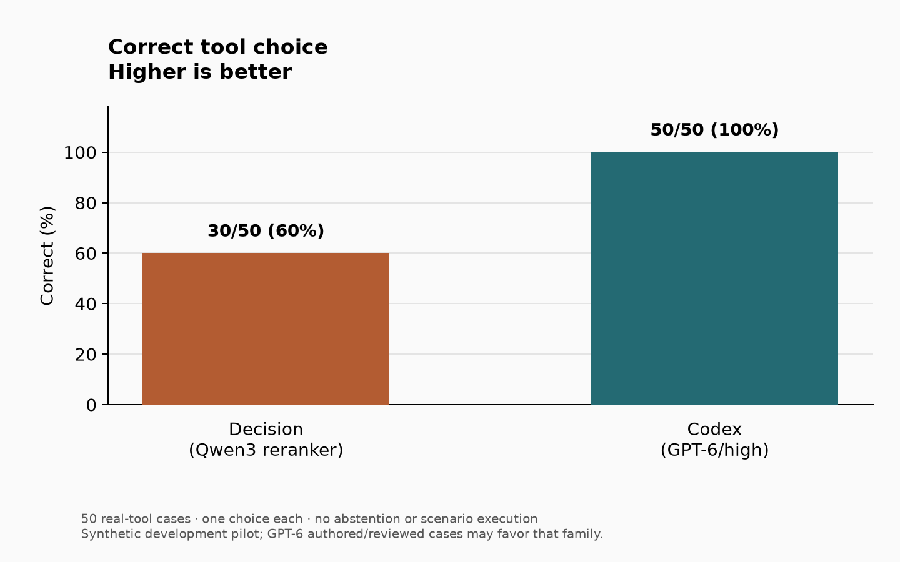
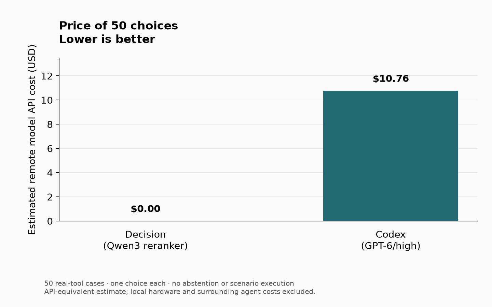
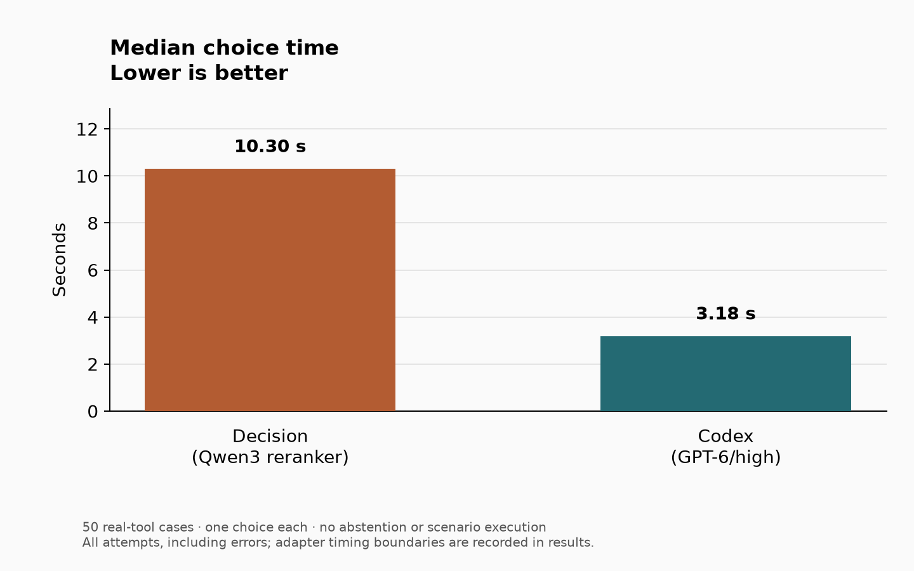

# Real tool-choice benchmark

**50 realistic decision points. One correct real Codex tool per case. Three plots: correctness, price, and speed.** No tool arguments, abstention option, or scenario execution.

From the repository root, reproduce the saved comparison without running a model:

```sh
uv run benchmark/bench.py
```

Open `benchmark/results/correctness.png`, `price.png`, and `speed.png`. The command also writes `cases.csv` and `summary.json`. `uv` installs the plotting dependency automatically; Python 3.11+ is required.

The included example is the **recorded Decision vs Codex run**, not a measurement of this repository's Rippletide plugin:

| Recorded chooser | Correct | Median choice | API-equivalent total |
|---|---:|---:|---:|
| Decision / Qwen3-Reranker-0.6B | 30/50 | 10.30 s | $0 remote inference |
| Codex / GPT-6 Astra, high | 50/50 | 3.18 s | $10.76 estimated |





## Run a fresh comparison

Use the repository's [one-time setup](../README.md#setup), including downloading the router model and installing the pinned Codex CLI. Reuse your existing Codex login. Fresh Codex inference can incur charges.

```sh
uv run benchmark/bench.py run
```

This runs **Rippletide**, then **Codex**, on all 50 unchanged inputs. Results and the same three plots go into a new `benchmark/runs/<timestamp>/` directory. The answer key is used only after inference. Each case gets one attempt per system; errors and invalid choices count as incorrect. The benchmark does not retry cases or ask Codex to make fallback choices on the router's behalf.

Select an already installed router model or another Codex model explicitly:

```sh
uv run benchmark/bench.py run --router-model qwen3-0.6b --codex-model gpt-6-astra
```

Rippletide's existing context bound, candidate sorting and routing deadline remain active. Oversized-input errors and operational defers are failures; the benchmark never shortens real descriptions to make a model accept them. Setup/model loading is recorded separately. The adapter invokes the real `Router.route` method with a temporary registry and neutral preferences; it does not exercise MCP transport or hook enforcement. Codex uses fresh ephemeral conversations with full candidate descriptions supplied as text. Shell, web, apps, MCP execution, hooks and memories are disabled; a read-only sandbox is enforced, and any observed tool attempt fails the run. Both timing boundaries are recorded in `results.json`.

Replot any completed result:

```sh
uv run benchmark/bench.py plot --input benchmark/runs/<timestamp>/results.json --out benchmark/results
```

## What the scores mean

There are ten cases each for local work, Codex desktop, Linear, Slack and Notion. Every case includes a request, prior context, applicable host instructions, and a candidate family of real callable tool IDs with full captured descriptions/declarations. Only the `input` object reaches the chooser. The gold answer and rationale are separate. For example, `rg` and `git diff` are both arguments to `exec_command`, not invented tools.

- **Correctness:** exact tool-ID match out of all 50 cases, including failures.
- **Price:** total remote model API-equivalent cost for 50 choices. The dated rates in [pricing.json](pricing.json) are estimates, not invoices. Missing usage or unknown model prices produce **N/A**, never $0. Local hardware, electricity, and the surrounding LLM's work are excluded.
- **Speed:** median recorded selection time over all 50 attempts, including errors. Missing timings produce **N/A**, rather than a median over only successful cases. Initial adapter/model setup is separate in new runs. The historical Decision sample includes its first model load, as recorded in its metadata.

This is a synthetic development pilot with 33 related scenario groups. GPT-6 authored/reviewed cases may favor its own model family. Candidate families are supplied; family selection, argument generation, actual tool execution, complete task performance, and live routing enforcement are outside scope. The tool snapshot represents one Codex runtime and its connections, not every installation. No live Linear/Slack/Notion credentials are needed.

## Inspect or extend

[Readable cases and answers](data/CASES.md) · [Frozen goal](data/GOAL.md) · [Review evidence](data/REVIEW.md) · [Exact tool snapshot](data/runtime-tools.json).

```sh
python3 benchmark/data/validate.py
python3 -m unittest discover -s benchmark/tests -p 'test_*.py'
```

For another chooser, pass `--router-command 'python3 /path/to/chooser.py'`. The process writes one `{"ready":true,"metadata":{...}}` line at startup, then reads one full `input` JSON object per stdin line and writes one response per stdout line:

```json
{"tool_id":"exec_command","elapsed_s":0.12,"cost_usd":0,"error":null}
```

Keep logs on stderr. Return `null` for unknown cost or unmeasured timing; report operational failures with an `error` and null `tool_id`. A `"fatal":true` response stops that chooser; remaining cases are marked unrun/incorrect with unknown timing and cost. Supply one of the exact candidate IDs, without explanations. The runner preserves per-case responses and wall timing in JSONL; it never sends labels, case IDs, family/group metadata, or reviewer notes to the chooser. Custom commands are trusted local programs and must honor the no-execution contract.

`example/results.json` contains the original 100 recorded choices, times, and available usage, normalized to this simple format. Its metadata retains raw-source hashes. The saved sample was independently audited; copying it here and replotting it performs no new inference. The frozen data files preserve the accepted SHA-256 fingerprints.
