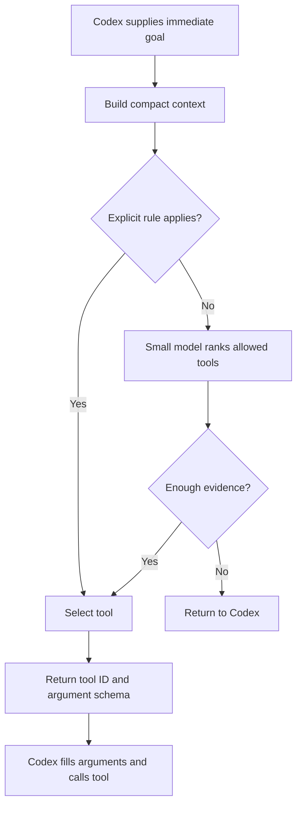

**This is a plausible product idea, but the integration point matters more than the model size.** I’d describe Rippletide as:

> A small, specialized decision engine that handles recurring tool choices using your project’s context and preferences, while Codex handles reasoning, code, and tool arguments.

The benefits—lower cost, lower latency, more consistent decisions—are **hypotheses to measure**, especially when the router introduces another round trip.

**1. What you can actually replace**

Your proposed split is:

1. Codex identifies what it needs to accomplish.
2. Rippletide chooses the appropriate tool.
3. Codex generates that tool’s arguments.
4. The tool executes.
5. Codex interprets the result.

That is a useful separation. However, **Codex does not expose a documented pause between its internal tool selection and argument generation.**

Plugins can supply skills, MCP tools, and lifecycle hooks. A `PreToolUse` hook sees an already-proposed tool call, including its arguments; it can block it, add context, or rewrite supported inputs. That makes it useful for checking decisions, but it is too late to save the reasoning already spent producing that call. [Plugin documentation](https://learn.chatgpt.com/docs/plugins), [Hooks documentation](https://learn.chatgpt.com/docs/hooks).

There are therefore three possible products:

| Approach                     | How it works                                                                        | Main limitation                                                  |
| ---------------------------- | ----------------------------------------------------------------------------------- | ---------------------------------------------------------------- |
| **Routing plugin**           | Codex explicitly calls Rippletide for a tool recommendation                         | Adds a tool round trip; Codex can still reconsider               |
| **Decision-checking plugin** | A hook checks proposed calls against preferences                                    | Improves consistency, but does not remove initial selection cost |
| **Custom agent runtime**     | Your code controls selection, argument generation, and execution as separate stages | More engineering; goes beyond a normal plugin                    |

**I would build the routing plugin first to validate decision quality, then decide whether a custom runtime is justified.**

**2. Architecture for the plugin**

Expose one primary MCP tool: `rippletide.route`.



The responsibilities should be clear:

| Component       | Responsibility                                                                   |
| --------------- | -------------------------------------------------------------------------------- |
| Codex           | Understand the task, identify the immediate goal, write code, generate arguments |
| Context builder | Assemble relevant project facts and recent observations                          |
| Tool registry   | Store tool IDs, descriptions, schemas, availability, and prerequisites           |
| Rules           | Apply explicit preferences and exclusions                                        |
| Small model     | Choose between remaining plausible tools                                         |
| Fallback logic  | Return uncertainty to Codex                                                      |
| Trace store     | Record decisions, overrides, latency, and outcomes                               |

**Use rules for preferences that are already explicit.** “Use `uv` in this repository” does not require RL. Learning becomes useful for choices such as when exact search is sufficient versus when semantic search helps.

Also distinguish **tool choice** from **workflow planning**. Selecting a search backend is a narrow classification problem. Deciding whether to investigate, edit, or run tests requires substantially more understanding. Start with the narrow problem.

**3. What “sufficient context” should mean**

Do not send the whole conversation to the small model. Start with a bounded decision packet:

```json
{
  "goal": "Find the implementation of validate_identity",
  "operation": "repository_search",
  "facts": {
    "exact_symbol": "validate_identity",
    "language": "python",
    "semantic_index_available": true
  },
  "recent_observations": [],
  "preferences": {
    "exact_symbol_search": "prefer_lexical"
  },
  "candidate_tool_ids": [
    "repo.lexical_search",
    "repo.semantic_search"
  ]
}
```

The router can return:

```json
{
  "status": "selected",
  "tool_id": "repo.lexical_search",
  "reason_code": "EXACT_SYMBOL",
  "registry_version": "v1"
}
```

The plugin attaches the selected tool’s argument schema from its registry. Codex then supplies the search pattern, path, and other arguments.

Important implementation details:

* **The registry supplies candidates.** Avoid making Codex enumerate every option each time.
* **The plugin collects mechanical facts locally**, such as configuration and tool availability.
* **Codex supplies the immediate goal**, because a plugin does not automatically inherit its entire context.
* Include `defer` as a valid outcome when information is missing.
* Treat repository text and tool output as data, never as instructions that can override routing policy.

A constrained output guarantees a valid tool ID. It does **not** guarantee that the choice is correct. Likewise, a model’s normalized probability is not automatically a calibrated confidence score.

**4. User story and user flow**

An example user story:

*As a developer using Codex across several repositories, I want routine tool choices to follow each project’s conventions, so that I spend less time correcting the agent and get more consistent execution.*

The proposed experience:

1. **Install Rippletide.**
   The developer connects the local router and chooses which supported tools it can recommend.

2. **Configure the project once.**
   Rippletide detects project configuration and offers editable preferences: exact search first, preferred documentation source, test runner, and available indexes.

3. **Work normally.**
   The developer asks: “Find why identity validation rejects this case and fix it.”

4. **Codex delegates a bounded choice.**
   It asks Rippletide how to locate the relevant implementation.

5. **Rippletide selects a tool.**
   An exact rule selects lexical search when a symbol is known. Otherwise, the small model chooses between available search methods.

6. **Codex continues.**
   It supplies arguments, inspects results, diagnoses the bug, and makes the change.

7. **The developer can correct a decision.**
   “Use semantic search for this kind of question.” Rippletide records that as feedback; an explicit lasting preference becomes configuration.

8. **A compact report shows what happened.**
   Decisions, fallbacks, overrides, and measured routing overhead are visible. Claimed savings come from benchmark comparisons, not guesses.

The user should not approve every routing decision. Existing tool permissions still apply when the selected action executes.

**5. How I would code it**

Use Python for the initial router and evaluation pipeline. Package it with a skill that tells Codex when to call it. Local MCP servers can run over STDIO, which provides a supported connection path. [MCP documentation](https://learn.chatgpt.com/docs/extend/mcp?surface=cli).

A proposed repository structure:

| Path                          | Purpose                                   |
| ----------------------------- | ----------------------------------------- |
| `.codex-plugin/plugin.json`   | Plugin metadata                           |
| `.mcp.json`                   | Router server configuration               |
| `skills/routing/SKILL.md`     | Instructions for bounded delegation       |
| `src/rippletide/server.py`    | MCP interface                             |
| `src/rippletide/context.py`   | Context construction                      |
| `src/rippletide/registry.py`  | Tool descriptions and schemas             |
| `src/rippletide/policy.py`    | Explicit rules and exclusions             |
| `src/rippletide/router.py`    | Model selection and fallback              |
| `src/rippletide/inference.py` | Replaceable model adapter                 |
| `evals/`                      | Labeled decisions and workflow benchmarks |

The core logic is small. Conceptually:

```python
def route(request, registry, policy, model):
    context = build_context(request)

    candidates = registry.available_for(context)
    candidates = policy.filter_allowed(candidates, context)

    if not candidates:
        return defer("NO_SUPPORTED_TOOL")

    choice = policy.explicit_choice(context, candidates)
    if choice is not None:
        return selected(choice, source="rule")

    prediction = model.rank(context, candidates)

    if not passes_evaluated_threshold(prediction):
        return defer("UNCERTAIN")

    return selected(prediction.tool_id, source="model")
```

This is pseudocode, not a claim about a particular inference library’s API.

**Do not route every tool call through this in the first version.** Limit it to one family—repository search is a reasonable starting point—and let Codex proceed normally elsewhere.

Also, an MCP router cannot assume it can discover or execute every native Codex tool. Begin with a registry of explicitly integrated tools. A recommendation returned to Codex is advisory unless your own execution layer enforces it.

**6. The model you linked**

The linked model card describes an MLX-based constrained decoding system for categorical outputs. Its reported benchmarks use `Qwen2.5-1.5B-Instruct-4bit` on an **M4 Max**, despite the repository’s “1B” name. Those are author-reported structured-decoding results, not evidence of coding-tool routing accuracy or end-to-end Codex savings. I also cannot establish from that card that it is the same model as Jev. [Model card](https://huggingface.co/harshatheg/Qwen-2.5-1B-RLCD).

It is worth testing as a candidate, but keep the inference adapter replaceable.

For personalization, I would progress through:

1. **Configuration:** explicit project and user preferences.
2. **Supervised fine-tuning:** context → accepted tool choice.
3. **Preference training:** compare accepted and rejected choices.
4. **RL:** only once you have reliable outcome-based evaluation.

Do not train blindly on whatever Codex selected. Codex’s choices are a baseline, not ground truth. Include human corrections and cases where several tools are equally acceptable.

**7. The experiment that decides whether this is a business**

Compare these on the same held-out tasks:

| Variant                            | What it tests                                |
| ---------------------------------- | -------------------------------------------- |
| Codex alone                        | Baseline                                     |
| Codex + clear routing instructions | Whether prompting already solves the problem |
| Codex + deterministic rules        | Whether a model is necessary                 |
| Codex + rules + small model        | Added value of learned routing               |

Measure **completed-task success, total time, total token cost, unnecessary calls, overrides, and fallback rate**. Split evaluation by repository or task family to avoid memorizing near-identical examples.

Your latency condition is:

**Codex work avoided > router inference + extra round trip + context preparation + retries.**

If Codex already chooses a tool and generates its arguments in one response, splitting that into two Codex responses may make it slower.

My suggested first milestone is therefore very concrete: **a local Rippletide MCP tool that chooses between a few repository-search methods, applies explicit preferences, can abstain, and produces evaluation traces.** Prove that narrow decision is useful before investing in RL or replacing the agent loop.
