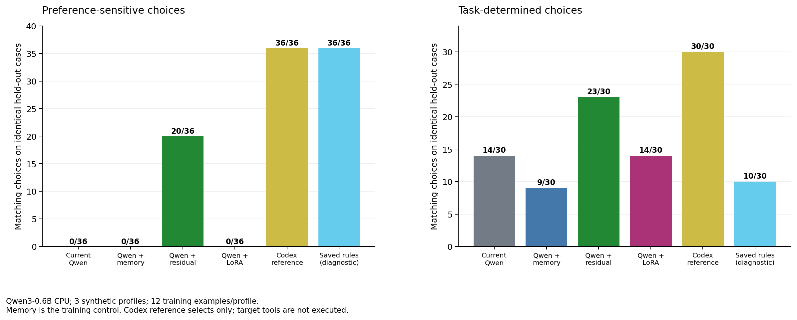

# Rippletide personalization experiment

**Date:** 18 September 2026  
**Status:** Complete. The controlled routing comparison, all three LoRA training
runs, the separate task pilot and supplemental GPU probes have finished.
Methods were written before the comparison finished; results were appended
without changing its fixed training configuration. The task pilot did not
establish a successfully completed routed workflow.

## 1. Research question

Does learning a user's routing preferences increase the number of tools or
specialists chosen according to those preferences, compared with the same router
before learning? Does changing model parameters add anything beyond simply
putting preferences and earlier corrections into the prompt?

The primary result is a paired count: **preferred choices before learning
versus preferred choices after learning, on the same 36 held-out
preference-sensitive cases**. We also measure whether personalization harms
choices for which the task specifies an objectively appropriate capability.

This is a synthetic feasibility study. It tests learning of explicit routing
preferences, not inference of a person's personality. It does not assume that
fine-tuning helps, or that matching a preferred tool proves a better final task
outcome.

## 2. Which model does what?

There are three different roles in the proposed product. Only one is being
personalized in this experiment.

| Role | Responsibility | Model in this experiment | Trained here? |
|---|---|---|---|
| Codex parent | Understand the task, identify an immediate need, construct actual tool arguments, execute tools, implement changes and interpret results | `gpt-6-astra`, reasoning effort `high`, through pinned Codex CLI 0.155.0 | No |
| Rippletide router | Choose one registered capability, or defer to Codex | Pinned local Qwen3-0.6B, with the treatment specified below | Only its residual policy or LoRA adapters, depending on arm |
| Specialist agent | Perform the bounded review or testing assignment prepared by Codex | Named Codex roles inheriting the parent's model settings | No |

The reviewer and test specialist are **different assignments and instructions**,
not separately fine-tuned foundation models. Selecting `agent.reviewer` changes
which role Codex invokes; it does not train the reviewer. The component benchmark
only scores that selection. The task pilot separately checks actual execution
and completion of specialists.

Rippletide selects a capability, not its arguments. If it selects semantic
search, Codex must then construct the semantic-search arguments using the
registered schema. If it defers, Codex chooses the next action itself. Thus a
router error or deferral need not imply a failed final task, and a correct
selection need not imply correct arguments or a successful fix.

## 3. Relation to the existing plugin

The updated repository has a rule-first router. Explicit preferences,
availability and deterministic routing rules can settle a choice before a local
model is called. The model is the unresolved-choice stage, not the entire plugin.

The original default alias is `qwen25-rlcd`. Its inference-engine source is
`harshatheg/Qwen-2.5-1B-RLCD`, but the configured weights are actually
`mlx-community/Qwen2.5-1.5B-Instruct-4bit`. The source repository's name is not an
accurate statement of the weight size used by this plugin. That path runs through
the pinned upstream MLX structured classifier and uses semantic labels such as
`grep`, `docs`, `review`, and `defer`.

The repository also offers direct-logit MLX alternatives, including
`qwen3-0.6b`, `minicpm5-2b`, and `qwen3.5-4b`. They use candidate letters and a
one-token readout. Neither the original default nor these MLX backends can be
measured on the supplied Windows/AMD machine using MLX.

For this experiment we added an **explicit** `qwen3-0.6b-torch` CPU backend. It
uses the existing direct-logit prompt and routing-label mechanism with official
Qwen3-0.6B weights. The default plugin model is unchanged. Throughout this report,
`current` means **the unpersonalized routing logic with this CPU Qwen3 reference
model**, not a measurement of the original default Qwen2.5 RLCD installation.
Any claim about the shipped default requires a separate Apple Silicon run.

Model identities are pinned in [catalog.py](../plugins/rippletide/src/rippletide/catalog.py)
and [identity.py](../plugins/rippletide/src/rippletide/identity.py).

## 4. Experimental arms

| Arm | Information available to the chooser | What changes? | What stays frozen? |
|---|---|---|---|
| Codex reference | Immediate need, candidate descriptions, declared preferences, one relevant training correction | Nothing; ordinary Codex selects an enum in a constrained response | All Codex parameters |
| `current` | Immediate need, facts, observations and candidate descriptions | Nothing; cold Qwen routing reference | All Qwen parameters |
| `memory` | Everything in `current`, plus declared preferences and one relevant training correction | Input context only | All Qwen parameters |
| `residual` | Exactly the personalized context supplied to `memory` | A small learned function adjusts Qwen's candidate logits | All Qwen parameters |
| `lora` | Exactly the personalized context supplied to `memory` | Low-rank attention adapters inside Qwen | Original Qwen weight tensors |

Each personalized profile has its own examples, residual weights and LoRA
adapter. Profiles are not pooled into a shared learned user representation.
Rules are not weakened to make a personalized model appear better.

A **supplemental saved-rules diagnostic** also exercises the existing plugin's
unconditional per-operation `preferences.prefer` settings, with a tripwire
preventing model inference. This was added after the main run began and is not
used for training, tuning or activation. It approximates the declared conditional
preferences with the coarse settings the existing rule API can express; it is
not an exact implementation of “prefer X only when both choices suit the task.”

### 4.1 Frozen Qwen: how a capability becomes a probability

The system prompt asks Qwen to select the next capability rather than perform
the task. The user message contains the immediate goal, candidate descriptions,
operation, compact facts and recent observations. Candidate IDs are mapped to
single-token option letters `A`, `B`, etc.; `Z` means defer. The pinned tokenizer
is checked for distinct, round-tripping one-token labels.

The model's native chat template is used with thinking disabled. One forward
pass produces next-token logits. The runner selects only the logits for the
available option letters and `Z`, applies a temperature-1 softmax, and chooses
the largest value. There is no sampling and no generated chain of reasoning.

For candidate logit `z_i`, the reported value is:

```text
p_i = exp(z_i) / sum_j exp(z_j)
choice = argmax_i p_i
```

The sum is over eligible capabilities plus defer. These values are
**uncalibrated probabilities conditional on this candidate set**; they are not
validated probabilities that a tool will succeed. Adding or removing candidates
can change them even when the underlying model is unchanged.

The input limit is 1,024 tokens. Old observations can be removed to meet that
limit; an input that still exceeds it returns a context failure. Such failures
are not credited as successful deferrals.

### 4.2 Memory: adaptation without parameter updates

The memory arm adds the profile's three declared preferences and at most one
earlier correction. Retrieval first requires the same operation and an expected
route that is still eligible. It ranks eligible corrections by token-set overlap
between goals/facts, with a deterministic decision-ID tie break.

The earlier route is converted to its letter in the **current** candidate list;
an option letter from an older ordering is never reused blindly. Only training
examples are eligible for retrieval. When preparing a training example, the
example itself is excluded from its own retrieved memory.

This arm is essential: changing Qwen's prompt already changes its output
distribution. A gain from `current` to `lora` alone cannot tell us whether the
gain came from learning weights or from adding preferences to the prompt.

### 4.3 Residual policy: learned scores outside Qwen

The residual arm leaves the transformer untouched. A learned linear function
adds a bounded correction to each candidate's frozen-Qwen logit:

```text
adjusted_logit_i = z_i + clip(w · features(context, candidate_i), -4, +4)
personalized_probability = softmax(adjusted_logits)
```

Features use words from candidate descriptions, operation-by-description
interactions and goal/fact-by-description interactions, with length
normalization. They do not use the arbitrary capability ID as a learned feature.
This allows an identically described renamed tool to retain the learned score;
it does not establish robust transfer to every new registry.

Training minimizes eligible-candidate cross-entropy with regularization 0.001,
30 deterministic shuffled passes and seed 31. Learning rates 0.1 and 0.3 are
compared **only on validation**. Selection prioritizes objective correctness,
then preference matches, then the smaller learning rate. The final test set
does not select this policy.

More precisely, the implementation computes the cross-entropy error
`p_i - indicator(i == target)` and updates the feature weights using that error
plus `0.001 * weight`. This corresponds to cross-entropy with an L2 term
`0.001 / 2 * ||w||^2`, with one caveat: the update treats the bounded logit
adjustment as having derivative one even when it is clipped. It is therefore a
straight-through update, not the exact gradient of the clipped objective.
Regularization is applied to feature weights touched by each example, rather
than performing a dense decay over the entire vocabulary of features. These
implementation details are part of the measured treatment.

This is genuine parameter learning in the routing system, but it is **not Qwen
fine-tuning**. Qwen's raw logits stay unchanged; a separate trained layer changes
the final routing distribution.

### 4.4 LoRA: trained parameters inside Qwen

The LoRA arm uses PyTorch and PEFT to train real low-rank adapters in the query
and value projections (`q_proj`, `v_proj`) of Qwen's final two transformer layers.
The model has 28 layers, so these are layers 26 and 27 using zero-based indexing.
For a projection `W`, LoRA applies:

```text
W_effective = W_frozen + (alpha / rank) · B · A
```

Only `A` and `B` are optimized. This changes Qwen's hidden computations and hence
the routing-token logits. Unlike the residual arm, the change occurs inside the
transformer. The base model is not overwritten and adapters are saved separately.
See the [PEFT LoRA documentation](https://huggingface.co/docs/peft/main/en/package_reference/lora).

The pilot fixes these settings before examining final-test results:

| Setting | Value |
|---|---|
| Rank / alpha | 4 / 8 |
| Adapter dropout | 0.05 during training; disabled in evaluation |
| Target modules | Query and value projections, final two layers |
| Verified trainable size | 40,960 parameters in each saved training artifact |
| Optimizer | AdamW, learning rate 0.0002, weight decay 0.01 |
| Gradient clipping | Maximum norm 1.0 |
| Examples | 12 per profile, 36 total; separate adapter per profile |
| Epochs / batch size | One epoch / one example per optimizer step |
| Random seed | 31 |
| Objective | Cross-entropy over the eligible capability labels plus defer |
| Generation training | None; neither explanations nor tool arguments are training targets |

The loss matches the inference decision space. It teaches the preferred label
among currently eligible labels rather than asking the model to reproduce an
entire assistant conversation.

```text
loss = -log(exp(logit_expected) / sum(exp(logit_j) for j in eligible_labels_and_defer))
```

After each example's forward pass, the code calls `loss.backward()`, clips the
gradient and calls `optimizer.step()`. One epoch means twelve such updates per
user adapter, thirty-six updates across three separate adapters. Validation and
test forward passes never call backward or an optimizer step. LoRA's AdamW weight
decay is decoupled from the reported cross-entropy loss.

To make the CPU pilot feasible, the frozen prefix's hidden states are cached for
training examples. During an optimizer step, only the final two layers are
evaluated from those cached states. The full model is used for held-out
inference. A tiny real Qwen/PEFT regression checks cached/full equivalence,
nonzero adapter gradients, unchanged base weights, and restoration of base
behavior after adapter unloading. This optimization does not cache labels or
test answers.

One epoch over 12 examples is a resource-limited feasibility setting. Poor results
would not establish that all LoRA configurations are ineffective; good results
would not establish convergence or generalization to real users.

An MLX direct-logit training implementation is also included, following the
[pinned MLX adapter API](https://raw.githubusercontent.com/ml-explore/mlx-lm/v0.31.3/mlx_lm/tuner/utils.py).
It has not been executed on this Windows host. The default upstream RLCD
classifier is not supported by the new training command.

## 5. Dataset and preference labels

The dataset is generated deterministically, with seed `20260918`. It contains
360 authored synthetic scenarios across three profiles. Labels are specified by
the dataset author, not by Qwen or a model grading its own answers.

| Profile | Unfamiliar code, when either search is suitable | Equally suitable information sources | Unspecified independent check |
|---|---|---|---|
| Developer A | Lexical keyword search | Product documentation first | Code reviewer |
| Developer B | Semantic code search | Issue tracker first | Test specialist |
| Developer C | Semantic code search | Product documentation first | Test specialist |

These are conditional preferences. An explicit request for ticket comments,
normative documentation or regression-test implementation takes priority over a
generic preference. Multiple tools may be acceptable while only one matches the
profile's preferred starting point.

Per domain and profile, there are twelve scenarios: two ambiguous repository
searches, two ambiguous information lookups, two unspecified specialist checks,
four task-determined lookup/testing cases, one exact-symbol rule case and one
unrelated-task deferral case. Candidate order is shuffled deterministically.

| Split | Domains | Cases | Role |
|---|---|---:|---|
| Train | Payment retries, cart discounts, cache eviction, document uploads, subscription renewal, inventory reservations | 216 available | Supply correction examples and training targets |
| Validation | Notification delivery, account recovery | 72 | Select residual learning rate and assess activation |
| Test | Session expiration, background job scheduling | 72 | Final paired comparison only |

The CPU pilot samples twelve non-rule training cases per profile using seed 31.
This is a deterministic random subset, **not a category-stratified sample**.
Both learned arms and the memory control receive the same selected history.
Only 36 of the 216 available training rows are used in this pilot.
The selected subset happens to contain six preference and six objective rows per
profile, spread over five lookups, four specialist assignments and three
repository searches. This small lab run calls the trainers directly; it does
not satisfy or exercise the product's default forty-corrections-per-user
automatic-training threshold.

Test and validation each contain 36 preference-sensitive cases, 30 objective
cases (including six intended deferrals), and six exact-symbol rule cases. Each
profile contributes twelve preference-sensitive test choices.

Domains, scenario-family IDs and sentence templates are disjoint between splits.
Capability types and preference concepts intentionally recur: the question is
whether a preference transfers to a new task, not whether the model invents an
unknown capability. Shared synthetic structure still creates correlation and
limits the strength of generalization claims.

Dataset digest:
`94fb4cb667df608b72c6ff269c415281472fc2ec0af8770c3ec57785efea7f17`.
The [dataset files](../experiments/datasets/preference-v1/manifest.json) and
[generator](../experiments/personalization_lab/dataset.py) are included.

## 6. Procedure and safeguards against misleading comparisons

1. Freeze the dataset, train/validation/test separation, base-model identity,
   training subset and LoRA settings.
2. Prepare personalized training contexts from that user's training history.
3. Evaluate frozen Qwen with and without memory on validation cases.
4. Fit residual candidates using training labels; choose their learning rate
   using validation only.
5. Record `current`, `memory` and residual choices on the same test rows.
6. Train a separate LoRA adapter for each profile on its training rows. Record
   validation and test predictions, then unload the adapter before the next
   profile so learned parameters cannot leak between users.
7. Assess whether each candidate passes the validation activation gate. Retain
   measured candidate results even when activation is rejected.
8. Compare the real Codex constrained-choice reference on the same held-out
   cohort. Separately attempt actual end-to-end tasks in fresh fixture copies.

All non-rule component cases use the actual local model; no selections are
mocked or obtained from expected labels. Exact-symbol cases exercise the actual
rule-first router with a tripwire that fails if the rule unexpectedly invokes
the model. Thus their successes do not count as evidence that Qwen learned.
The component runner intentionally supplies shuffled candidate orders directly
to the model. Production `Router.route` sorts candidates by ID before model
inference. Before/after comparisons use the same order for each case, but this
perturbed component experiment is not a byte-for-byte replay of the complete
production router. The task pilot exercises the actual router ordering.

The Codex reference uses a fresh isolated configuration for each request, an
enum output schema, the same preferences/retrieved history as the memory arm,
and no target-tool execution. Its prompt differs from Qwen's letter prompt
because Codex returns registered IDs. There is also a serialization difference:
Qwen's memory formatter drops a retrieved example whose preferred route is
`defer`, whereas the Codex packet retains it. All three personalized Qwen arms
share that formatter, so the primary learned-versus-memory comparison has the
same information, but the Codex comparison is not exactly information-matched.
This is a practical chooser reference,
not a perfectly controlled comparison of foundation-model architectures.

### Validation and activation

The lab gate requires a strict increase in validation preference matches, no
decrease in objective matches, and no additional inference errors versus memory.
The test set is never used to choose activation. A rejected LoRA candidate can
still be scientifically informative, but is not presented as a successfully
deployed improvement.

The product learning command has a separate, conservative gate because real
correction history has preference labels rather than this synthetic objective
test suite. It splits whole correction families deterministically, requires at
least ten training and six validation corrections, and compares a candidate
against both memory and the incumbent learned policy. Promotion requires strict
improvement and zero validation inference errors. This gate does not independently
establish task correctness, and should not be described as production-grade
evaluation of all downstream behavior.

## 7. Metrics and interpretation

The main table reports counts, especially **before / 36** and **after / 36**;
paired comparisons report the change in percentage points. We also report:

* Improvements: a previously non-preferred choice becomes preferred.
* Regressions: a previously preferred choice becomes non-preferred.
* Preference matches per profile, each out of twelve.
* Objective matches out of thirty, with six rule cases reported separately.
* Acceptable choices, which need not equal preferred choices.
* Model deferrals and operational errors, kept distinct.
* Median and 95th-percentile observed latency; training cost and adapter size.
* Validation acceptance/rejection and independent task acceptance where runnable.

The central comparisons are:

```text
memory - current       = benefit of supplying preference context
residual - memory      = additional effect of the learned scoring policy
lora - memory          = additional effect of transformer adapter training
lora - current         = combined user-facing before/after change
```

Paired uncertainty uses 2,000 bootstrap resamples of whole synthetic scenario
families, keeping users within each family together, with seed 31. Only twelve
preference-sensitive test families are available. Intervals are exploratory:
they do not eliminate correlation from a shared author or template design.

Router forward-pass timing excludes model loading and some orchestration costs;
Codex reference timing includes a CLI request. These are different boundaries,
so their raw milliseconds cannot establish an end-to-end speedup. Residual
component results reuse memory-arm logits and timings; their recorded latency
does not independently measure the small scoring overhead. Full task wall time
is a separate measure.

## 8. Hardware, software and reproducibility

The supplied machine is a Ryzen 5 5500U with AMD Vega 7 integrated graphics,
running Windows. The controlled comparison uses the CPU, not CUDA or MLX. Initial inspection
found approximately 7.4 GiB total RAM and less than 1 GiB available. Qwen inference
uses four CPU threads and float16 weights; the original downloaded model file is
not a 4-bit MLX quantization.

| Component | Pinned value |
|---|---|
| Python | 3.12.13 |
| PyTorch | 2.7.1+cpu |
| Transformers | 4.57.6 |
| PEFT | 0.18.1 |
| Qwen weights | `Qwen/Qwen3-0.6B` |
| Weight revision | `c1899de289a04d12100db370d81485cdf75e47ca` |
| Weight SHA-256 | `f47f71177f32bcd101b7573ec9171e6a57f4f4d31148d38e382306f42996874b` |
| Model structure | 28 layers; hidden size 1,024; 16 query heads; 8 key/value heads |
| Codex CLI | 0.155.0 |
| Codex parent model / effort | `gpt-6-astra` / `high` |

The component experiment bypasses the production routing deadline so it can
measure model behavior on this hardware. The plugin's normal deadline remains
two seconds. The task pilot explicitly allows 120 seconds per CPU routing
decision. Accuracy measured with that longer budget does not establish that the
same setup is usable within the normal interactive deadline.

Commands and artifact conventions are in
[experiments/README.md](../experiments/README.md). The main run is
`.lab-runs/personalization-cpu-v1`; the Codex reference is
`.lab-runs/codex-reference-v1`. Per-case predictions include prompt digests,
candidate logits, selected probabilities and failure reasons. Adapters include
base identity, checksums and training statistics. Raw model weights and private
run directories are ignored by Git.

## 9. End-to-end task pilot

The component benchmark controls the immediate choice. The task pilot asks
whether the whole workflow works: inspect the expired-session issue, consult
current requirements, repair the code, verify behavior and obtain a bounded
specialist review. Each arm starts from the same fresh U05 session-service
fixture. The real fixture MCP servers expose documentation and tracker reads;
an independent grader checks the expiration boundary, revocation and missing
sessions.

The parent model and effort are held constant, and its prompt contains the same
declared user preferences in all arms. Plugin arms load the checkout's skill,
MCP service and routing hook in a private Codex configuration. This tests actual
development components, **not download/install marketplace behavior**. The
runner retains calls, router decisions, specialist rollouts, code snapshots and
acceptance results separately.

A correct code result alone does not prove the requested specialist ran, and a
selected specialist ID is not completion evidence. A task is fully verified only
when the independent checks pass, the required information services actually
ran, and a specialist completed. Sandbox or host-configuration failures remain
infrastructure failures and must not be assigned to Qwen accuracy.

One initial task attempt encountered blocked shell commands in an isolated
Windows configuration. That attempt is retained under `.lab-runs/tasks-v1`.
With Windows sandboxing configured, the baseline under `.lab-runs/tasks-v2`
completed in 78.266 seconds, passed all five independent acceptance checks and
obtained the named reviewer. That attempt lacked hook telemetry, so a further
instrumented attempt was made under `.lab-runs/tasks-v3`. Its code checks and
reviewer completed, but it made no information-service calls during the task.
The final baseline under `.lab-runs/tasks-v4` explicitly verified both fixture
MCP servers, hook telemetry and named specialists in preflight. Its task took
115.781 seconds, passed all five code checks and completed the reviewer, but
again made no information-service calls during the task. This is an observed
incomplete workflow despite a successful preflight, not an established Qwen
failure or a proven host defect.

An evidence audit caught an initial grader error: preflight reads were being
counted as task reads. The grader now filters calls by the actual task session's
start and finish times, and the derived results were corrected while preserving
raw logs. A regression test covers this distinction. The final task comparison
uses `tasks-v4`; earlier attempts remain separate and are not pooled to select a
favorable outcome.

### 9.1 Final task outcomes

All four attempted arms started from the same source snapshot and passed their
preflight requirements. Plugin preflights included a real `rippletide.status`
call confirming the model worker was ready. This setup evidence is separate
from actual task execution.

| Task arm | Task wall time | Independent code checks | Actual fixture reads | Recorded routing decisions | Completed task specialist | Full task verified |
|---|---:|---|---:|---:|---|---|
| Codex baseline | 115.781 s | 5/5 pass | 0 | 0 | Reviewer | No |
| Current plugin | 96.969 s | 5/5 pass | 0 | 0 | None | No |
| Memory plugin | 28.782 s | Fail; code unchanged | 0 | 0 | None | No |
| Residual plugin | 80.781 s | 5/5 pass | 4 | 0 | None | No |
| LoRA plugin | Not attempted | — | — | — | — | Validation rejected its adapter |

The baseline did not read the required information sources during its task.
Current and memory task agents reported the required router unavailable and
encountered routing-hook blocks; current still made a provisional code fix,
whereas memory stopped without modifying code. The residual task read the
current requirement and reported issue and fixed the code, but did not complete
the requested specialist review. Its recorded router-decision count was also
zero, so this outcome cannot be credited to the learned residual.

In the residual attempt, a registered documentation search completed without
a corresponding recorded routing decision, while a tracker search and the
reviewer launch were blocked for missing decisions. Follow-up document and
known-issue fetches were treated as unregistered operations by the hook. This
exposes a host/skill/hook integration problem requiring further investigation;
the successful preflight does not resolve it. The exact cause of tool discovery
and hook-coverage inconsistencies was not established by this experiment.

**None of the final task attempts demonstrated the complete requested workflow.**
No plugin task actually exercised a recorded Qwen routing decision, despite the
worker being ready during preflight. Consequently, task outcomes and durations
cannot establish a before/after benefit from training. They are retained as
negative integration findings, alongside the valid controlled component results.
The rejected LoRA adapter was not forced into use to obtain a task result.

## 10. Results

### 10.1 Preferred choices before and after learning

**The residual improved preference matches from 0/36 to 20/36. The tested LoRA
configuration improved them from 0/36 to 0/36.** Adding preference memory alone
also produced 0/36 matches. The real Codex constrained-choice reference matched
all 36 preference labels without any fine-tuning.

| Arm | Preferred choices / 36 | Objective choices / 30 | Rule choices / 6 | All labels / 72 | Deferrals / 72 |
|---|---:|---:|---:|---:|---:|
| Codex constrained reference | 36 | 30 | 6 | 72 | 6 |
| Current frozen Qwen | 0 | 14 | 6 | 20 | 58 |
| Qwen + memory | 0 | 9 | 6 | 15 | 63 |
| Qwen + learned residual | 20 | 23 | 6 | 49 | 23 |
| Qwen + LoRA candidate | 0 | 14 | 6 | 20 | 58 |
| Existing unconditional saved rules (supplemental) | 36 | 10 | 2 | 48 | 4 |



All four Qwen arms completed all 72 test cases without inference errors.
Frozen Qwen, memory and LoRA each deferred on **all 36 preference cases**.
Residual deferred on 15, made 20 preferred choices, and made one acceptable but
non-preferred choice. Six objective cases intentionally require deferral, so
deferring is not intrinsically a failure; the problem is excessive deferral on
requests for which suitable capabilities were supplied.

The saved-rules diagnostic maximizes preference agreement here but harms
objective choices and even exact-symbol rules. Four of its deferrals reflect
an unavailable saved preferred capability, not a neural inference crash.
This control illustrates why preference matches alone cannot justify deployment.

The paired residual gain over **memory**, which has the same contextual
information, is **20 additional matches, zero regressions, +55.6 percentage
points**. The exploratory family-bootstrap 95% interval is +38.9 to +72.2 points
(2,000 resamples, 12 scenario-family clusters). The same gain holds relative to
unpersonalized Qwen because both controls matched zero preference cases.
LoRA's observed preference gain is zero. Its bootstrap interval is [0, 0] on
this cohort; that does not establish that other datasets or LoRA configurations
have exactly zero effect.

| Profile | Current / 12 | Memory / 12 | Residual / 12 | LoRA / 12 | Codex / 12 |
|---|---:|---:|---:|---:|---:|
| Developer A | 0 | 0 | 5 | 0 | 12 |
| Developer B | 0 | 0 | 9 | 0 | 12 |
| Developer C | 0 | 0 | 6 | 0 | 12 |

All 72 retained Codex reference parent rollouts were audited: none contained a
function, custom-tool, web-search or computer call, and no rollout was missing.
Its perfect result is therefore a constrained selection result, not evidence of
72 successfully executed tools or completed development tasks.

### 10.2 Did learning actually change the probabilities?

Yes. Consider the predetermined first repository-search test case for A:
“Track down the implementation behind session expiration, starting without
function names or filenames.” A's expected choice is lexical search.

| Arm | Probability assigned to lexical search | Probability assigned to defer | Selected |
|---|---:|---:|---|
| Current | 0.0151% | 99.9741% | Defer |
| Memory | 0.2511% | 99.7457% | Defer |
| Residual | 54.1983% | 45.6561% | Lexical search |
| LoRA | 0.6903% | 99.2942% | Defer |

Thus LoRA changed the output distribution in the desired direction for this
example, but not enough to change the selected capability. Probability movement
and improved tool-choice counts are different outcomes. The exporter includes
nine examples selected by a fixed rule (first preference case per user and
operation), including failures. For example, residual incorrectly chooses the
tracker for C's first information-lookup case despite C preferring documentation.
These conditional softmax values are uncalibrated; they do not measure the
probability that a tool will solve the task.

### 10.3 Validation and activation

Validation was separate from the final test cohort. Each profile had twelve
preference cases, ten objective cases and two rule cases for this gate.

| Profile / treatment | Memory preference matches | Candidate preference matches | Memory objective matches | Candidate objective matches | Gate |
|---|---:|---:|---:|---:|---|
| A / residual | 0 | 2 | 2 | 9 | Pass |
| B / residual | 0 | 7 | 3 | 9 | Pass |
| C / residual | 0 | 7 | 2 | 7 | Pass |
| A / LoRA | 0 | 0 | 2 | 2 | Reject |
| B / LoRA | 0 | 0 | 3 | 6 | Reject |
| C / LoRA | 0 | 0 | 2 | 3 | Reject |

All three residual policies passed. All three LoRA adapters failed the strict
preference-improvement requirement. The LoRA results above describe measured
**candidate adapters**, not policies that would have been activated. The task
runner refuses to promote a rejected adapter; deployed behavior would remain
memory. These lab gates are distinct from the product's correction-based gate,
which additionally compares the candidate with any incumbent active policy.

### 10.4 Actual training, latency and resources

Each saved LoRA adapter contains **40,960 trainable parameters** and a
164,912-byte safetensors file (about 161 KiB), with original Qwen weights frozen.
Each received twelve examples and twelve optimizer updates. The artifacts
include base identity, checksums, training statistics and separate validation.

| Adapter | Steps | Mean observed training loss | Reported training wall time |
|---|---:|---:|---:|
| A | 12 | 4.2953 | 734.62 s |
| B | 12 | 3.8097 | 848.99 s |
| C | 12 | 4.7103 | 4,443.11 s, including a long sampling gap |

These means are losses observed on different examples during optimization, not
an independently evaluated training-set loss after convergence. First-versus-last
example loss is not a valid convergence curve. Training times exclude the
earlier full-model passes used to cache frozen-prefix features.

The process began at 14:26:08 UTC and its final inference completed at 17:41:43
UTC on 18 September. Monitoring recorded a **3,679.37-second gap** between
16:30:04 and 17:31:23 UTC, during which process CPU time increased by only
9.66 seconds. This is consistent with a pause or suspended machine, but the
cause was not established. The gap overlaps C's training and means its reported
wall time must not be interpreted as 74 minutes of continuous computation.
Supplemental GPU probes also ran during later training and may have caused
resource contention.

| Arm | Median actual neural inference, 66 test cases | Maximum | Within normal 2 s deadline |
|---|---:|---:|---:|
| Current | 9.111 s | 14.405 s | 0/66 |
| Memory | 14.700 s | 22.997 s | 0/66 |
| Residual | 14.700 s, inherited memory timing | 22.997 s | 0/66 |
| LoRA | 15.189 s | 18.546 s | 0/66 |

The residual benchmark reuses the memory forward-pass timings; its small external
score-adjustment overhead was not timed independently. These figures exclude the
six fast deterministic rule decisions. The initial model-loading smoke test took
approximately 73 seconds. Peak process resident memory reported by Windows was
1.815 GiB; the lowest sampled system-available memory was about 212 MiB.
Resource sampling began after initial loading, although the Windows peak-memory
counter and cumulative CPU time cover the process lifetime. GPU feasibility and
its separate timing results are reported in Section 12.

This CPU configuration fails the plugin's normal two-second interaction budget
for every measured neural test request. Its accuracy under an unrestricted
component run or a 120-second task deadline does not establish interactive
production usability. No monetary or energy-cost measurement was collected.

### 10.5 Interpretation and limits

The measured result supports a narrow conclusion: **a small external learned
residual can improve this Qwen router's preference agreement beyond supplying
the same information in its prompt**. The particular twelve-example, one-epoch
LoRA treatment did not improve the primary metric and would not be activated.
This is neither evidence against LoRA generally nor evidence that the plugin
outperforms Codex: Codex already reached the synthetic cohort's ceiling.

The frozen router's excessive deferral is a major finding. Before investing in
larger personal adapters, a follow-up should test the choice prompt/readout and
compare a simple defer-bias adjustment, a standalone small classifier, and
conditional saved rules. Those ablations were not run here. Consequently,
the residual gain cannot be attributed exclusively to learning user-specific
preferences rather than also repairing general deferral behavior.

The dataset contains authored, templated scenarios rather than observed user
choices; it has only three profiles, twelve training examples per profile and
one training seed. A stronger study would collect consented real corrections,
measure learning curves at increasing data sizes, hold out whole projects,
test preference changes and registry changes, and repeat full development tasks.
The original default Qwen2.5 RLCD/MLX backend was not measured on this Windows
machine. The component comparison and the single-task pilot answer different
questions and cannot be pooled into a single overall accuracy claim.

### 10.6 Implementation verification and retained evidence

The final plugin/UAT/experiment test run completed with **190 passed and 18
skipped** in 204.93 seconds. Skips comprise 15 opt-in real-model checks, two
Windows symlink-privilege prerequisites and one Unix process-group check;
they do not verify MLX execution. The plugin manifest and updated skill passed
their validators. A tiny real Qwen/PEFT regression verified cached-prefix
equivalence, adapter gradients, frozen base weights and restoration after unload.

The separate, older root `unittest` suite is **not green on this Windows host**:
19 tests ran, with 15 passing, two skipped, one failure and one error. Its existing
pilot driver requires an unavailable authentication symlink privilege, and its
plugin-discovery test assumes Unix-style cache paths. Those older files were not
changed by this experiment. The portable lab's passing suite does not establish
that every legacy installation path works on Windows.

The shareable [results JSON](assets/personalization/personalization-results.json)
contains per-case choices, aggregate comparisons, validation decisions, training
provenance, probability examples, hardware/package metadata and the Codex audit.
The [PNG](assets/personalization/personalization-preference-matches.png) and
[SVG](assets/personalization/personalization-preference-matches.svg) figures are
standalone artifacts. Raw synthetic runs, private task configuration and local
model files remain under ignored `.lab-runs` / `.lab-cache` directories.

## 11. What could happen automatically for a plugin user?

Downloading a plugin supplies code and possibly model artifacts; it does not
create personal training data or cause Qwen to understand a new user's habits.
A feasible product flow is optional first-use preferences, explicit consent to
learn corrections, immediate memory-based adaptation, then local background
training after enough examples accumulate.

A proposed onboarding conversation would ask about keyword versus semantic
search when both suit the request, documentation versus the issue tracker when
either can answer, and reviewer versus testing specialist when either fits the
assignment. Each should allow no preference or skipping. A separate learning
setting would ask whether explicit corrections may be stored and used for local
background training. These are proposed questions, not an implemented automatic
first-mention questionnaire. Declared preferences immediately enter Qwen's
context; they are not automatically converted into fabricated training labels.

The implemented pilot provides profile initialization, explicit feedback
collection, memory, residual/LoRA training, validation, versioned activation and
rollback. Defaults do not collect training corrections. With prior opt-in,
the MCP service checks for eligible new history while it is running; the default
threshold is forty corrections, plus the disjoint validation requirements.
Forty is an operational eligibility threshold, not a statistical guarantee of
sufficient data or useful training. The pilot's twelve examples per user bypass
that product threshold only inside the separate experiment runner.
Training pauses its inference worker to avoid loading two base models, and Codex
receives deferrals during that maintenance period. Profile changes trigger worker
reload. A first activation can be rolled back to memory.

Setup is currently exposed through the CLI, MCP status and the skill's guided
instructions. This experiment does **not** prove a shipped first-install dialog,
universal download-triggered automation, acceptable training performance on
every user's computer, or a continuously running service when Codex is closed.
The default RLCD model does not yet support the new trainer. A compatible
direct-logit backend and its dependencies must be configured explicitly.

Personalization remains local in this implementation. Corrections can contain
task text and should stay in the user's private profile directory. A remote
training service would require separate infrastructure and an authorized data
transfer; it is not implemented here. Local training can run automatically
**after setup and consent on a supported host**, but automatic useful learning
for every person immediately after download is not an established result.

## 12. Supplemental Vega 7 / DirectML feasibility probe

The user subsequently asked whether the idle integrated GPU could help. AMD's
[ROCm 7.14.1 compatibility matrix](https://rocm.docs.amd.com/en/docs-7.14.1/compatibility/compatibility-matrix.html)
does not list the Ryzen 5500U / Vega 7 among supported APUs. However,
[PyTorch with DirectML](https://learn.microsoft.com/en-us/windows/ai/directml/pytorch-windows)
supports training and inference through DirectX 12 on Windows. Lack of official
ROCm support therefore does not establish that this GPU cannot run the workload.

A separate `.lab-dml-venv` uses `torch-directml==0.2.5.dev240914`, its required
`torch==2.4.1`, `transformers==4.57.6` and `peft==0.18.1`. It does not replace the
main run's pinned PyTorch 2.7.1 CPU environment. The driver reported by Windows
was `30.0.13044.14002`; DirectML detected `AMD Radeon(TM) Graphics`.

The initial probe passed GPU matrix multiplication and backward propagation,
a small random Qwen3 forward pass matching its CPU reference, and two actual
LoRA optimizer updates. A second probe loaded the real model's final two layers,
its final normalization and the four eligible output-head rows. It used one
315-token cached training input and trained the same 40,960 adapter parameters.
The reconstructed CPU suffix exactly matched the previously cached full-model
logits. The GPU suffix differed by at most 0.03125 in those logits and retained
the same selected option on this one input. Two GPU training steps completed
in approximately 0.80 and 0.47 seconds in the first diagnostic run.

These are encouraging device-feasibility results, not a full-model speedup
measurement. The probe uses eager attention, a reduced output head, a different
PyTorch version, only one cached input and an arbitrary diagnostic target.
One optimizer operation (`aten::lerp.Scalar_out`) falls back to the CPU. The main
CPU experiment was also running during the probes; its later wall times include
possible resource contention. The matched suffix check uses four CPU threads
and explicitly copies an updated adapter parameter back before ending the GPU
timer, so asynchronous dispatch is not mistaken for completed training.

| Diagnostic with the same cached suffix/input | CPU, PyTorch 2.4.1 | Vega 7, DirectML / PyTorch 2.4.1 |
|---|---:|---:|
| Timed forward pass | 15.816 s | 0.893 s |
| First LoRA optimizer step | 75.643 s | 0.843 s |
| Second LoRA optimizer step | Not run | 0.510 s |

The first-step ratio is approximately 90x **for this specific reduced probe**.
Only one CPU training step and two GPU steps were measured, under concurrent
load. This ratio cannot be assigned to full Qwen inference, the complete lab
workflow, or the main run's different PyTorch 2.7.1 CPU backend. It establishes a
promising GPU route that should have been investigated before committing to the
long CPU pilot.

Evidence: [small compatibility probe](assets/personalization/directml-compatibility.json),
[matched CPU suffix](assets/personalization/directml-suffix-cpu.json),
[matched GPU suffix](assets/personalization/directml-suffix-gpu.json).
The [probe implementation](../scripts/probe_directml_qwen_suffix.py) retains the
precise simplifications. No GPU observations are pooled with the controlled
before/after preference results, and GPU execution has not yet been integrated
into the plugin's routing worker.
